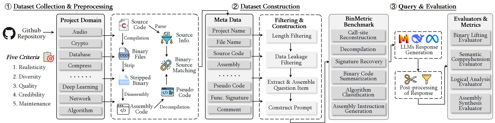

# BinMetric: A Comprehensive Binary Analysis Benchmark for Large Language Models

## Deps

pull docker image
```bash
docker pull dockcross/linux-x64:latest
```
install pypi deps
```text
codebleu==0.4.0
rouge_score==0.1.2
```

## Usage for users

```Python
from evaluator.data import read_problems, write_samples, generate_one_prompt
from user_impl_script import generate_one_completion
problems = read_problems()
samples = [
    dict(task_id=task_id, completion=generate_one_completion(generate_one_prompt(problem))) for problem in problems
]
write_samples(samples)
```

## Queryllm

We provide here scripts to infer locally deployed LLMs and call ChatGPT via API.

```bash
CUDA_VISIBLE_DEVICES=0 python infer_llama.py
```

## Evaluation

```bash 
python evaluation.py --prediction_file ./queryllm/Llama-2-7b-chat-hf_prediction.json --problem_file ./problem_data.json
```

## Workflow



